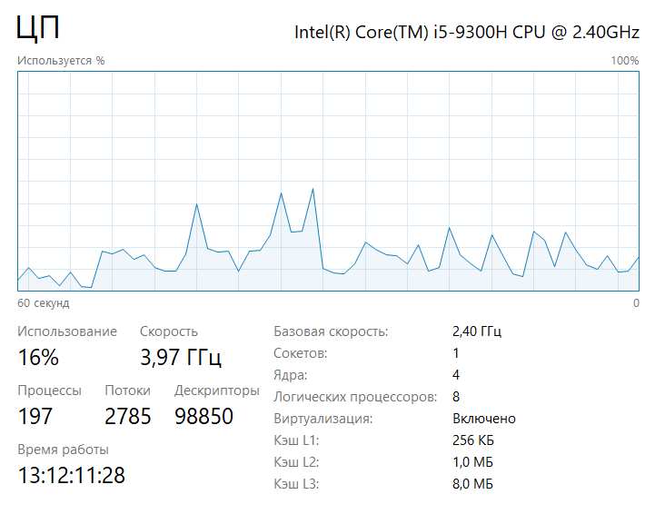
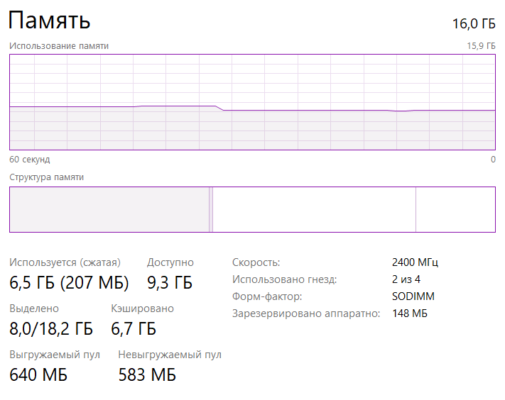

Синхронная проверка:

Память:

Процессор:

Сеть:

Время работы: 1303764ms = 21,7 m

max_workers = 5

Память:

Процессор:

Сеть:

Время работы: 557925ms = 9,3 m

max_workers=10

Память:

Процессор:

Сеть:

Время работы: 391481ms = 6,5 m

max_workers=100

Память:

Процессор:

Сеть:

Время работы: 315087ms = 5,3 m

Вывод: Загрузка памяти не зависит от количества воркеров. При увеличении числа воркеров: загрузка проццесора - увеличивается, загрузка сети - увеличивается, время работы - уменьшается.

Генерируем монетки (6): 

Память:

Процессор:

Сеть:

Время работы: 373090ms = 6,2 m

max_workers = 2

Память:

Процессор:

Сеть:

Время работы: 566232ms = 9,4 m

max_workers = 4

Память:

Процессор:

Сеть:

Время работы: 419699ms = 7 m

max_workers = 5

Память:

Процессор:

Сеть:

Время работы: 546221ms = 9,1 m

max_workers = 10

Память:

Процессор:

Сеть:

Время работы: 590152ms = 9,8 m

max_workers = 100

Ошибка: 

Вывод: Загрузка памяти и сети не зависит от количества воркеров. При увеличении числа воркеров, загрузка процессора - увеличивается. Сильной зависимости времени работы программы от количества воркеров я не заметил, больше зависит от скорости нахождения монеток(везения).